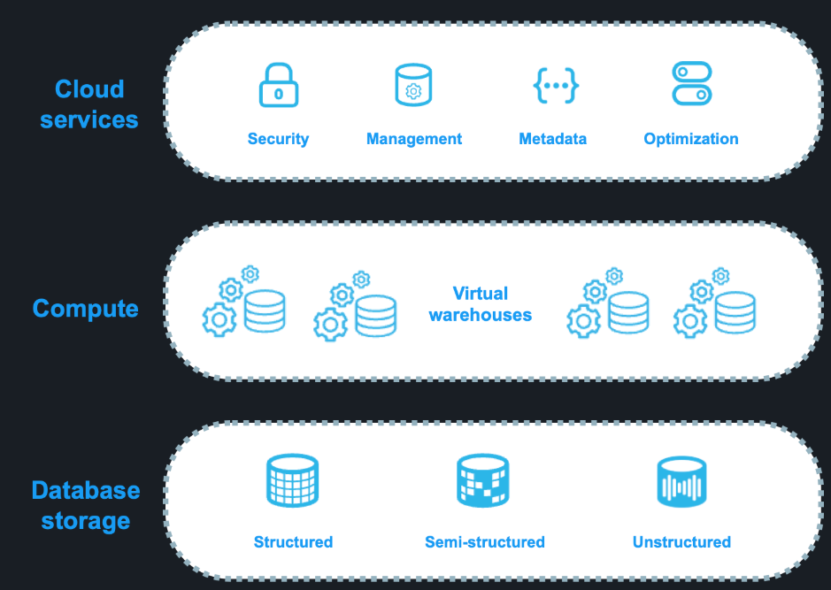

# Snowflake Architecture

## 1. Database storage

- Actual data will store in cloud provider and managed by Snowflake. It provide something to work with data effectively:
    + Compress data
    + Micro-partion: Snowflake divide data to multi partition, main purpose help queries faster through skipping scan data
- According to docs, SnowFlake support 3 types of data:
    + Structure 
    + Semi-structure
    + unstructure
- Object level:
    + First level: Database 
    + Second level: Schema, It likes a folder to contain Objects
    + Last one: Objects (Table, View, Task,,,), place to actually work in Snowlake

## 2. Compute

- Compute in Snowflake in virtual warehouse managed by Snowflake
- There are a lot of type for special purpose and data volume
- It support auto-scale
- More detail is mentioned in compute session

## 3. Cloud service

-The cloud services layer is a collection of services that coordinate activities across Snowflake