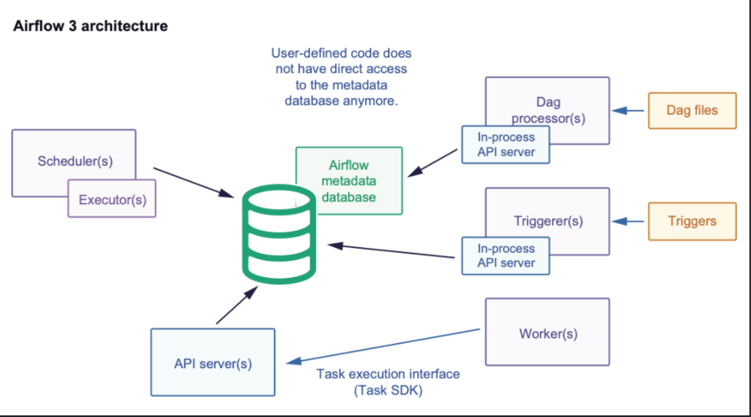

# Airflow 3 Fundamental 

## 1. The purpose of Airflow
- use to create, schedule, coordinate and track the pipeline or workflow 
- before airflow, people use `cron job` for schedule, but:
    + It only allow set to run
    + With a sequense of job, we need to guess the time to complete the previous step to set time to current step
    + Airflow also provide the UI for monitor jobs
    + Airflow help run jobs parallel and distribute more earsily 
    + It provide template to handle retries policy and dependencies

## 2. Airflow 3 Architecture and core component 

### 2.1 DAG bundle 
- A place contains DAG code. For example, A folder
### 2.2 DAG processor
- Find DAG files -> check syntax and something like that
- Run DAG files and create DAG objects and tasks 
- Serialize DAG structure and store it to metadata DB
`Serialize mean that convert object to datatype can store in DB` 
### 2.3 Metadata database
- It is a central storage for status and coordinate
- It will store:
    + serialized DAGs
    + DAGs run
    + task instance 
    + status 
    + start time and end time 
    ...
- For example:
```
dag_run:
  dag_id: daily_orders
  run_id: scheduled__2026-08-30
  state: running

task_instance:
  dag_id: daily_orders
  task_id: transform
  state: queued
  try_number: 2
  ```
### 2.4 Scheduler
- It will run a infinity loop to find which tasks will be run 
- The flow of Scheduler:
    + check available DAGs  -> create DAGs Run 
    + check task dependencies -> check resource 
    + transfer qualified tasks to scheduler status
    + send task to Executor -> trace the results and handle retries 
### 2.5 Executor
- Executor is a scheduler strategy to decide how and where tasks run. It not an independent component. It is just a feature or configuration in scheduler
- Type of Executor:
    + LocalExecutor: task become processes and run in same compute with scheduler
        + usage: in a small system, only a strong compute,...
    + Celery Executor: Scheduler send task to massage brokers like producer and worker will get and consumer like consumers
        + usage: there are many workers and want to scale by increase the number of workers
    + Kubenetes Executor: run the task with independent Pod
        + usage: need to isolate resource for each specfic task, 

### 2.6 Worker
- Worker will receive tasks and directly run it like this:
```
Run:
DAG ID       = daily_orders
Task ID      = transform
Run ID       = scheduled__2026-08-30
Try number   = 1
DAG version  = xyz
```
- Airflow just assign task, and worker have right DAG version, necessary dependencies can access API server
- Scheduler send to worker a JWT, so worker dont need DB account to get Data from DB
- The worker includes:
    + supervior process: 
        - keep JWT
        - call Execution API 
        - keep Connection/Variable
    + Task:
        - run code 
        - Task runtime 
### 2.7 API server 
- Serve Web UI, Public REST API, Execution API  for task and worker
### 2.8 Triggerer
- Without Triggerer, worker need to live to wait and run task => It is waste a lot of cost.
- Triggerer will live and trace that when condition is true and make worker live to run this job
## 3. Airflow 2 vs Airflow 3
- Airflow 2 is difficult to secure:
    + task can access internal DB and change it
    + Workers need to DB information -> many woker will have many DB connects
- Airflow 3 provide a API server to avoid workers/tasks access directly to DB
## 4. Core workflow concepts:
```
- DAGs: DAGs Run 1 (1/9/2026), DAGs Run 2 (2/9/2026),...
- Task Instance: Task1_morning, Task1_night,...
```

- DAG (Directed Acyclic Graph) define a flow, it can contain:
    + dag_id
    + schedule
    + start_date
    + Tasks
    + Task dependencies
    ....
- DAG Run: a specific time that the DAG is run (such as: everyday, every week,...)
- Task is a work unit. It define such as get_data, clean_data, caculate_data,...
- Task Instance is a specific time that the DAG is run and it contains:
    + dag_id
    + task_id
    + run_id
    + DAG ID
    + Try number
    + Start date
    .....
- Operator: is a teamplate for specific job type to define a task
    + shell command
    + SQL Operator
- Sensor: is special type of tasks for waiting requirement  
    + Poke mode: keep worker live and wait a short time
    + Reschedule mode: check once if dont meet condition -> free resouce and schedule again
- Task state:
    + none
    + schedule
    + sucess
    + running
    + fail
    + up_for_retry: task error and wait to retry
    ....
- Dependencies: All condition whether task run or not 
    + Upstream task state
    + Trigger rule
    + DAG Run active ?
    ....
## 5. Scheduling concepts
- Schedule: When Airflow create a DAG Run
- Cron expression:
```
@dag(
    schedule="0 2 * * *",
    ...
)
```
- logical date: the time to run
- Data interval: which data need to run 
- Catch up:
    + false: only care about new data
    + true: run days that were missed. For example, job run everyday but right now start_date: 01/08 and deploy_data: 10/08 , it will additionally run data 2/8, 3/8,.. 9/8
- Backfill: run again a priod in the past
- Manual run: run DAGs manually by users
- Event-driven run: run when event arrive 
## 6. Reliable workflow design
- Idempotency: same workflow and same data always bring a same result in situations:
    + Retry
    + Worker die
    + Backfill.
    + Redeploy.
    + network error
- Retry: use when temporary errors happen such as:
    + API timeout.
    + Database is temporally unavailable.
    + Rate limit.
- Timeout: it help us avoid waiting forever
- Failure handling:
    + for temporally: -> will retry and backoff
    + Data error: wrong schema, null is not null field -> Depend on bussiness (fail task, alert,..)
    + code or config error:ImportError SQL, syntax error -> fail and fix it as soon as possible 
