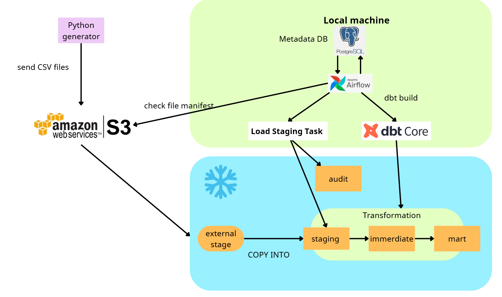

# Plan and architecture of project
## 1 Overall
- build the pipeline for a shop: S3 -> Snowflake (Staging -> intermediate -> mart)
- dbt Core is responsible for transformation in Snowflake
- Airlow coordinate the pipeline 
## 2 Architecture 

- Link of Architecture: [link](https://canva.link/7ytfpk5f7u65w6z)
## 3 Source
- Every day python will upload a batch to S3 include the manifest file and real data:
    + customers.csv: 
        - customer_id
        - customer_name
        - email
        - city
        - create_at
        - update_at
    + products.csv: 
        - product_id 
        - product_name
        - category
        - list_price: price > 0 
        - updated_at
    + orders.csv: 
        - order_id
        - customer_id
        - ordered_at
        - status: pending, paid, shipped, completed or cancelled
        - shipping_amount
        - tax_amount
        - updated_at
    + order_items.csv:
        - order_item_id
        - order_id
        - product_id
        - quantity
        - unit_price
        - discount_amount
        - updated_at
    + payments.csv: 
        - payment_id
        - order_id
        - transaction_type: capture hoặc refund
        - status
        - amount
        - processed_at
        - updated_at
    + shipments.csv: 
        - shipment_id,
        - order_id
        - shipped_at
        - promised_delivery_at
        - delivered_at
        - updated_at
    + manifest.json
## 4 Intermediate
- handle duplicate, NULL value,... (preprocessing)
- keep newest update_at with each key for, :
    + int_customer: read from customer
    + int_product: read from product
    + int_order: read from order
    + int_payments:read from payment
    + int_shipments: read from shipment
- int_order_items, keep newest update_at with each key and add:
    + line_gross_amount: quantity * unit_price
    + line_net_amount: quantity * unit_price - discount_amount
- int_order_item_totals (one row for one order)
    + order_id,item_quantity (sum),gross_merchandise_amount(sum),discount_amount(sum),merchandise_sales(sum)
- int_order_payment_totals:
    + order_id,captured_amount (sum when type = capture and status = success),refunded_amount(sum when type = refund and status = success),net_cash_collected (captured_amount - refunded_amount)
- int_order_enriched: one row for a order with full information (join to get whole information)
    - order_id,customer_id,ordered_at,order_date,order_status,item_quantity,gross_merchandise_amount,discount_amount,merchandise_sales,shipping_amount,tax_amount,order_total,captured_amount,refunded_amount,net_cash_collected,shipment_id,shipped_at,promised_delivery_at,delivered_at,is_late_delivery
## 5 Output 

- fact_order:
    + order_id
    + customer_id
    + order_date
    + order_status
    + item_quantity
    + gross_merchandise_amount: quantity × unit_price
    + discount_amount
    + merchandise_sales
    + shipping_amount
    + tax_amount
    + order_total: merchandise_sales + shipping_amount + tax_amount
    + captured_amount
    + refunded_amount
    + net_cash_collected: captured_amount − refunded_amount
    + shipped_at
    + promised_delivery_at
    + delivered_at
    + is_late_delivery: true if it miss the dealine and NULL if have not delivery yet
- dim_customer
    + customer_id
    + customer_name
    + email
    + city
    + created_at
    + updated_at
- dim_products
    + product_id
    + product_name
    + category
    + list_price
    + updated_at
- mart_daily_sale:sumary 1 day business:
    + order_date
    + order_count
    + cancelled_order_count
    + customer_count
    + item_quantity
    + gross_merchandise_amount
    + discount_amount
    + merchandise_sales 
    + avg_order_value: merchandise_sales / order_count
## 6 Task 
- check_s3: wait for manifest file and check that have enough 6 file and correct structure 
- load_staging: run COPY INTO files from S3 to staging, handle audit:
    + compared manifest will real data is loaded 
    + logs time and error
- dbt_build: process data from staging to intermediate, from intermediate to mart
    + see audit in run_results.json and airflow logs
### 7 Implement
- Snowflake:
    + Virtual warehouse X-Small
    + Auto-suspend 60s
- Airflow: 
    + run everyday at 10PM 
    + allow pass batch day to run it manually 
    + max_active_run = 1 and retry twice 
### 8 Plan
- Day 1:
    + set up project 
    + use python push CSV file to S3 
    + create connect and pull data from S3 to Staging with copy into and setup audit 
- Day 2:
    + dbt build succeed
    + nine Intermerdiate tables and four Mart tables exist
    + fct_orders has one row per order
- Day 3: 
    + Set up Airflow
- Day 4:
    + retry policy, handle exception and error
    + complete full pipeline
- Day 5:
    + Test all situation: sucess, fail, retry
    + Write Docs