# Day 1: S3 and Snowflake Infrastructure
- The Task day 1:
    + set up project 
    + use python push CSV file to S3 
    + connect Snowflake to the S3 bucket, and verify that Snowflake can access the batch files through an External Stage.

## 1. Set up project 
- create Github repo: https://github.com/cucuong-us/snowflake_dbt_airflow
- create account AWS 
- create account Snowflake 
- install AWS CLI at my laptop 
- ask AI to create 2 batch data (each batch includes 6 CSV file and a minifest file)
## 2. Use python to push CSV files to S3
- create a Bucket with
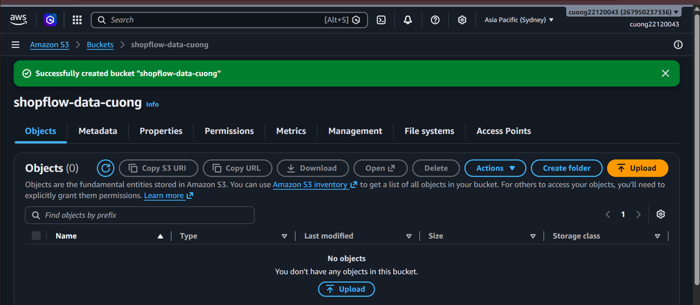
    + Name: shopflow-data-cuong
    + Region: ap-southeast-2
    + Prefix: shopflow/landing/ (prefix like folder, it automically create when the object is loaded)
- config AWS CLI
    + create credential with access key and secret for local machine:
    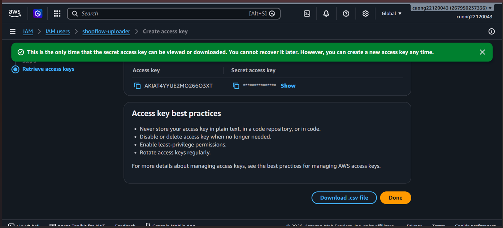
    + config profile:
    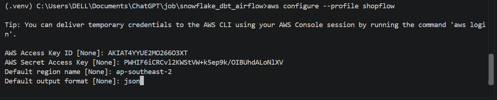
    + can test identity with `aws sts get-caller-identity --profile shopflow` in the terminal:
    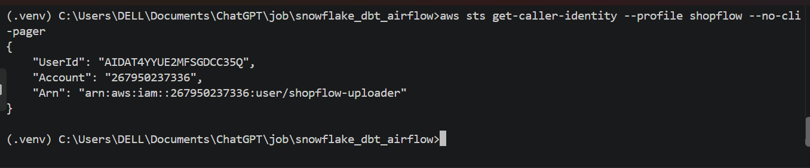
    + Validate the manifest:
- The manifest records every expected CSV file, its row count and its SHA-256 checksum. SHA-256 is calculated from the entire file content, like that:
    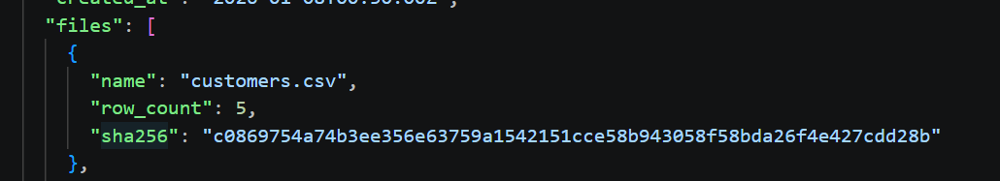
    + It is helpful for audit later 
- Upload the first batch:
    + write a python critpt to upload to S3 
    + run it: `python data_generator\upload_to_s3.py --batch-date 2026-01-07 --delay-seconds 0`
    + the result is 6 fields uploaded: 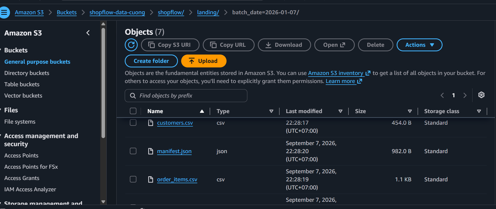
## 3: Connect Snowflake to S3 and verify file access
- Create a IAM role for snowflake: shopflow-snowflake-s3-role. for:
    + Get the bucket location
    + List objects under `shopflow/landing/`
    + Read objects and object versions under shopflow/landing/
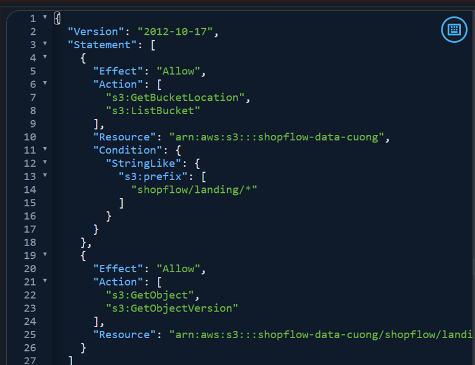
- The local uploade and Snowflake use separate AWS identities
    + Local Python: IAM User -> write to S3
    + Snowflake: IAM Role -> read from S3
- run `snowflake/01_create_infrastructure.sql` in a Snowflake SQL Workspace to create:
    + WH: SHOPFLOW_WH
    + DB: SHOPFLOW
    + Schema: SHOPFLOW.STAGING
    + Storage Integration: SHOPFLOW_S3_INT
- run `DESCRIBE INTEGRATION SHOPFLOW_S3_INT;` for the trust:
    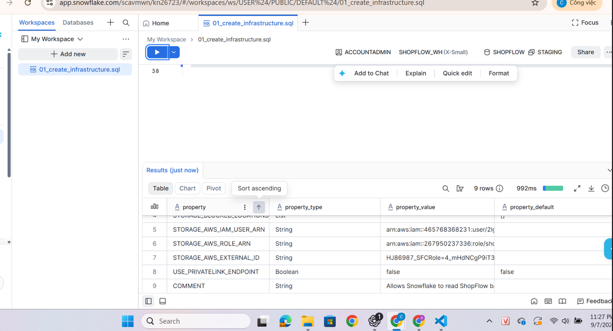
    +  `STORAGE_AWS_IAM_USER_ARN`: the AWS identity used by Snowflake
    + `STORAGE_AWS_EXTERNAL_ID`: a unique value for this integration
- Create the CSV File Format to tell snowflake about the source file:
    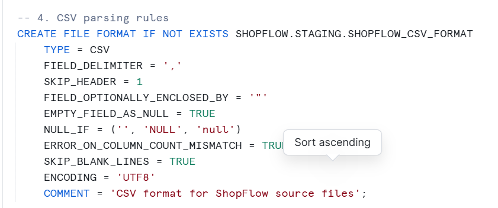
- Create the External Stage to check files in S3:
    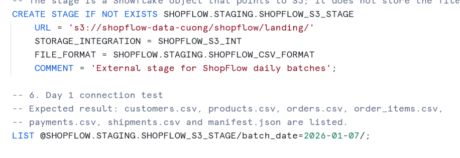
    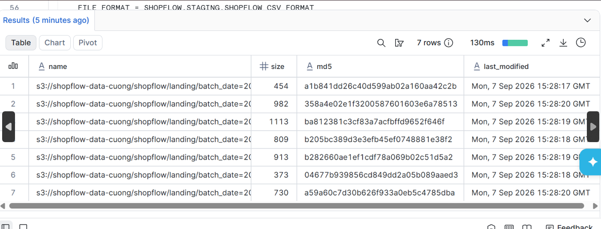