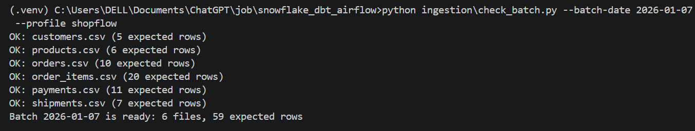
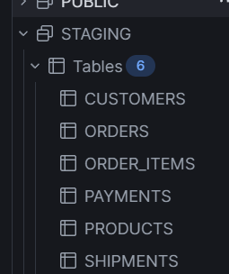
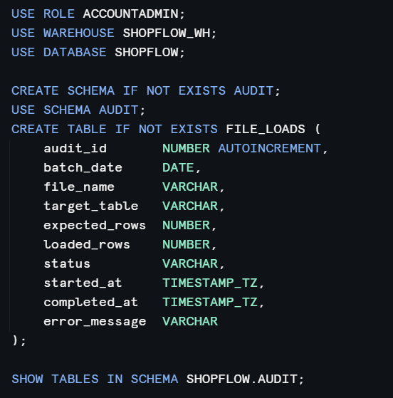
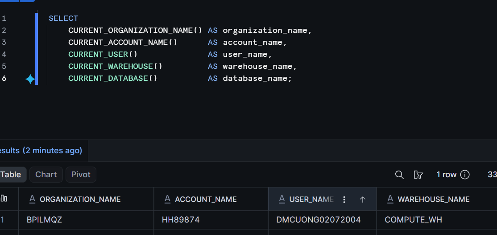
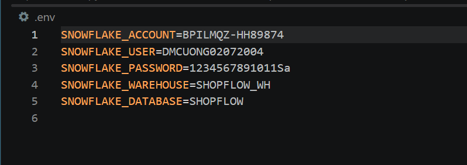
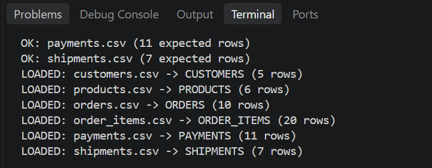
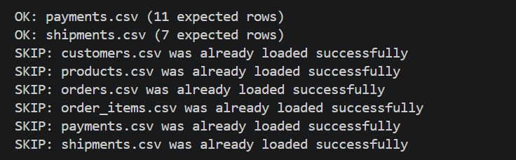
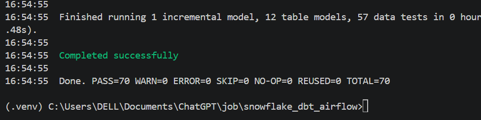

# Day 2: 3 main task of pipeline
- Tasks in Day 2:
    + dbt build succeed
    + nine Intermerdiate tables and four Mart tables exist
    + fct_orders has one row per order
## 1 IAM User and IAM role:
- IAM User:
    + is a long time identity
    + have the stable password or Access Key
    + add permission policy to define what user can do 
    + application use credential of use to log in
- IAM role:
    + is a identity contain permission policies 
    + don have the stable credential
    + user or app use assume role to get temporarily credential
    + permission policis define what the Role can do 
    + trust policy define who or which app can assume Role 

## 2 check S3 before load 
- create check_batch.py
- It includes:
    + reads manifest.json from S3
    + confirm `batch_id` matches the `batch_date`
    + have enough 6 CSV file 
    + check total 7 file exist in S3 
    + check SHA-256 metadata of each file
    + read the expect row count of each file 
- the command to run: `python ingestion\check_batch.py --batch-date 2026-01-07 --profile shopflow`

## 3 load data from S3 to staging 
- create staging tables: 6 tables for containing 6 csv files
- add `batch_date` and `loaded_at` for each table to clarify sources and the date load data


- create audit table with columns in the picture:



- need to prepare data for connection, get information và setup it to .env:




- run the cripts:
    + maps each CSV file to staging table
    + add batch_date and loaded_at for all table 
    + get loaded_rows from COPY INTO result and compare with expected_rows
    + writes `SUCCESS` or `FAIL` to audit table 
- the command to run: `python ingestion\load_staging.py --batch-date 2026-01-07 --profile shopflow`


- because check audit table before loading with this code:
```SELECT COUNT(*)
FROM SHOPFLOW.AUDIT.FILE_LOADS
WHERE batch_date = %s
  AND file_name = %s
  AND status = 'SUCCESS';
  ```
- it will detect and skip:

## 4 dbt for transformation
- install:
    + dbt-snowflake
    + python-dotenv
    + snowflake-connector-python 
- create dbt project with 3 main resources:
    + source: reference data in staging
    + immerdiate: process data and enriched them 
    + mart: dim + fact table and daily numbers
    + and some other components for dbt project 
- run dbt project with command `dotenv -f .env run -- dbt build --project-dir dbt_shopflow --profiles-dir dbt_shopflow`
- When run it will:
    + get snowflake credential from profile
    + read project dbt
    + test 6 staging source 
    + build intermediate 
    + build mart 
    + run all data test 
=> complete pipeline and data will be transformed and placed in Snowflake 

