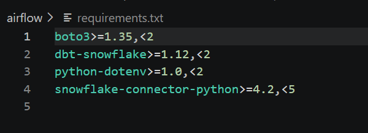
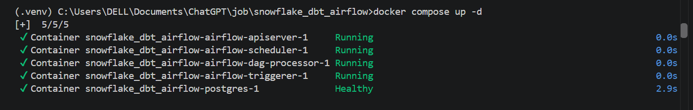
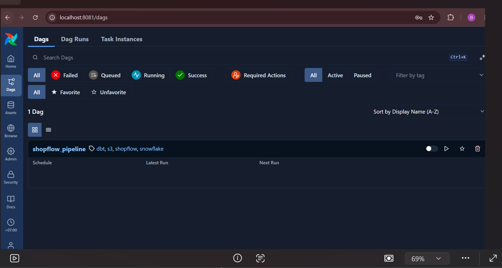
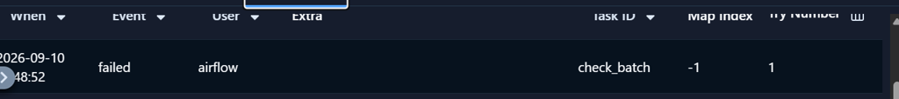

# Day 3 Set up and run Airflow
## 1 code 
- show_pipeline.py to define the DAGs with 3 task I define in day 2 and set parameter (the date data is uploaded)
    + check_batch
    + load_staging
    + dbt_build
- docker-compose.yml includes components
    + postgreSQL for metadata DB
    + airflow API server: it is a UI in localhost:8081
    + airflow scheduler
    + airflow triggerer
    + airflow init run a time for init, create account
- Dockerfile:
```
ARG AIRFLOW_VERSION=3.3.0
FROM apache/airflow:${AIRFLOW_VERSION}-python3.12

ARG AIRFLOW_VERSION

COPY airflow/requirements.txt /tmp/shopflow-requirements.txt
RUN pip install --no-cache-dir \
    "apache-airflow==${AIRFLOW_VERSION}" \
    -r /tmp/shopflow-requirements.txt
```

- its main purpose to install some dependencies in shopflow-requirements.txt:
    

## 2 Run docker 
- docker compose --profile init up airflow-init (run once):
    + read docker-compose.yml to file airflow-init 
    + build image Airflow if it is necessary 
    + start postgreSQL
    + check healthy
    + database migration 
    + create user admin
- when run docker compose it will:
    + build image from dockerfile
    + init postgreSQL
    + run airflow services
    + get variable from .env
    + mount source code to container
    + mount DAGs 
    + and after that I can open port 8081 
    
    
## 3 Run DAGs
- data of first batch was loaded yesterday
- try to run trigger DAG to create a DAG Run -> failed at check_batch task

- load new batch from local to S3 
- try to run again => It is success
